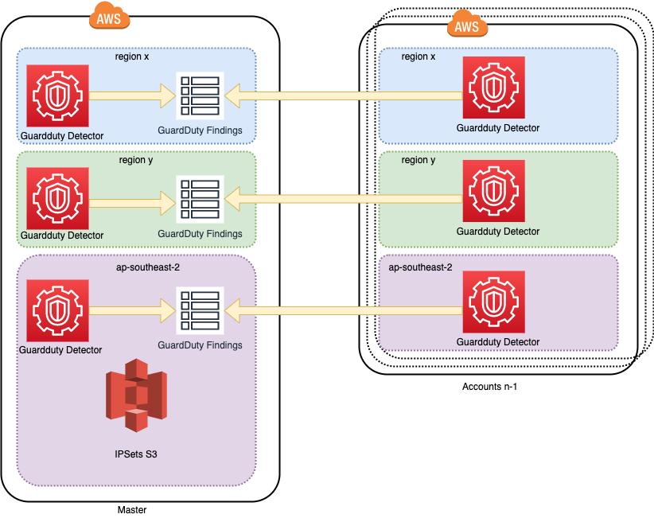

<!-- vim: set ft=markdown: -->

# cmd-tf-aws-guardduty-org

#### Table of contents

1. [Overview](#overview)
2. [AWS GuardDuty - Overview Diagram](#aws-guardduty---overview-diagram)
3. [AWS GuardDuty Terraform](#aws-guardduty-terraform)
    * [Resources docs](#resources-docs)
    * [Inputs](#inputs)
    * [Outputs](#outputs)
4. [License](#license)

## Overview

Amazon GuardDuty is a continuous security monitoring service that analyses and processes the following data sources: VPC Flow Logs, AWS CloudTrail event logs, and DNS logs. It uses threat intelligence feeds, such as lists of malicious IPs and domains, and machine learning to identify unexpected and potentially unauthorised and malicious activity within your AWS environment.

This repo contains Terraform modules for configuring AWS GuardDuty via AWS Organisations and optionally managing IPSets and ThreadSets used by GuardDuty.

This module only needs to be run once. All existing AWS Organisation member accounts and all future AWS Organisation member accounts will be added automatically.

Terraform >= 0.12.20 is required for this module.

## AWS GuardDuty - Overview Diagram

## AWS GuardDuty Terraform

### Resources docs

AWS GuardDuty automation includes use of the following core Terraform resources:

- [`aws_guardduty_organization_admin_account`](https://www.terraform.io/docs/providers/aws/r/aws_guardduty_organization_admin_account.html) - A resource to manage the Guardduty Organisation Admin Account.
- [`aws_guardduty_organization_configuration`](https://www.terraform.io/docs/providers/aws/r/guardduty_organization_configuration.html) - A resource to manage the Guardduty Organisation in the current AWS Region.
- [`aws_guardduty_detector`](https://www.terraform.io/docs/providers/aws/r/guardduty_detector.html) - A resource to manage a GuardDuty detector.
- [`aws_guardduty_ipset`](https://www.terraform.io/docs/providers/aws/r/guardduty_ipset.html) - IPSet is a list of trusted IP addresses.
- [`aws_guardduty_member`](https://www.terraform.io/docs/providers/aws/r/guardduty_member.html) - A resource to manage a GuardDuty member.
- [`aws_guardduty_threatintelset`](https://www.terraform.io/docs/providers/aws/r/guardduty_threatintelset.html) - ThreatIntelSet is a list of known malicious IP addresses.

### Inputs

The below outlines the current parameters and defaults.

| Name | Description | Type | Default | Required |
|------|-------------|:----:|:-------:|:--------:|
|bucket_enable|Enable the use of S3 buckets for Guardduty|bool|true|No
|bucket_name|Name of the S3 bucket to use|string|""|Yes|
|force_destroy|(Optional) A boolean that indicates all objects should be deleted from the bucket so that the bucket can be destroyed without error. These objects are not recoverable.|bool|false|No|
|detector_enable|Enable monitoring and feedback reporting|bool|true|No|
|ipset_enable|Enable the use of IPSet|bool|true|No
|ipset_format|The format of the file that contains the IPSet|string|TXT|No|
|ipset_iplist|IPSet list of trusted IP addresses|list|[]|No|
|threatintelset_enable|Enable the use of ThreatIntelSet|bool|true|No
|threatintelset_format|The format of the file that contains the ThreatIntelSet|string|TXT|No|
|threatintelset_iplist|ThreatIntelSet list of known malicious IP addresses|list|[]|No|

### Outputs

|Name|Description|
|------------|---------------------|
|detector_id|The ID of the GuardDuty detector|
|account_id|The AWS account ID of the GuardDuty detector|

## License

Apache 2.0.